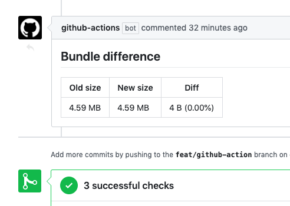

# Webpack Stats Diff

Creates a comment inside your Pull-Request with the difference between two Webpack stats files.



## Usage

To use this Github action, in your steps you may have:

```yml
uses: chronotruck/webpack-stats-diff-action@1.0.0
with:
  base_stats_path: '/path/to/my/stats.json'
  head_stats_path: '/path/to/my/stats.json'
  token: ${{ secrets.GITHUB_TOKEN }}
  comment_title: 'Custom title'
  announcement_percentage_threshold_increase: 0
  announcement_percentage_threshold_decrease: 1.0
```

## Inputs

| Inputs          | Required | Default           | Description                                                                                   |
|-----------------|----------|-------------------|-----------------------------------------------------------------------------------------------|
| base_stats_path | true     |                   | Path to the Webpack generated "stats.json" file from the base branch.                         |
| head_stats_path | true     |                   | Path to the Webpack generated "stats.json" file from the head branch.                         |
| token           | true     |                   | Github token so the package can publish a comment in the pull-request when the diff is ready. |
| comment_title   | false    |'Bundle difference'| Customized GitHub comment title.                                                              |
| announcement_percentage_threshold_increase | false | undefined | Only announces bundle difference when the diff percentage increase exceeds this value.  The value should be a positive numeric value (integer or floating point) or zero. |
| announcement_percentage_threshold_decrease | false | undefined | Only announces bundle difference when the diff percentage decrease exceeds this value. The value should be a negative numeric value (integer or floating point) or zero.|

## Usage example

If you want to compare the bundle size difference between your base branch and your pull-request head branch.

We suppose that when you build your webpack app, a `stats.json` file is created. See https://github.com/webpack-contrib/webpack-bundle-analyzer for usage examples.

You'll need to build your Webpack bundle for the head branch:

```yml
on:
  pull_request:

jobs:
  build-head:
    name: 'Build head'
    runs-on: ubuntu-latest
    steps:
    - uses: actions/checkout@v1
    - name: Install dependencies
      run: npm ci
    - name: Build
      run: npm run build
```

Then we will use the Github Actions feature called "[artifacts](https://help.github.com/en/actions/automating-your-workflow-with-github-actions/persisting-workflow-data-using-artifacts)" to store that `stats.json` file.

```yml
    - name: Upload stats.json
      uses: actions/upload-artifact@v1
      with:
        name: head-stats
        path: ./dist/stats.json
```

Now you can do the exact same thing, but for the base branch. Note the checkout step!

```yml
  build-base:
    name: 'Build base'
    runs-on: ubuntu-latest
    steps:
    - uses: actions/checkout@v1
      with:
        ## Here we do not checkout the current branch, but we checkout the base branch.
        ref: ${{ github.base_ref }}
    - name: Install dependencies
      run: npm ci
    - name: Build
      run: npm run build
    - name: Upload stats.json
      uses: actions/upload-artifact@v1
      with:
        name: base-stats
        path: ./dist/stats.json
```

Now, in a new job we can retrieve both of our saved stats from the artifacts and use this action to compare them.

```yml
  compare:
    name: 'Compare base & head bundle sizes'
    runs-on: ubuntu-latest
    needs: [build-base, build-head]
    steps:
    - uses: actions/checkout@v1
    - name: Download base artifact
      uses: actions/download-artifact@v1
      with:
        name: base-stats
    - name: Download head artifact
      uses: actions/download-artifact@v1
      with:
        name: head-stats
    - name: Diff between base & head
      uses: chronotruck/webpack-stats-diff-action@1.0.0
      with:
        token: ${{ secrets.GITHUB_TOKEN }}
        base_stats_path: ./base-stats/stats.json
        head_stats_path: ./head-stats/stats.json
```

That's it! When the compare job will be executed, it will post a comment in the current pull-request with the difference between the two stats.json files.

## License

This project is licensed under MIT License.
Open source time proudly sponsored by [Chronotruck](https://developers.chronotruck.com/?ref=github-webpack-stats-diff).
